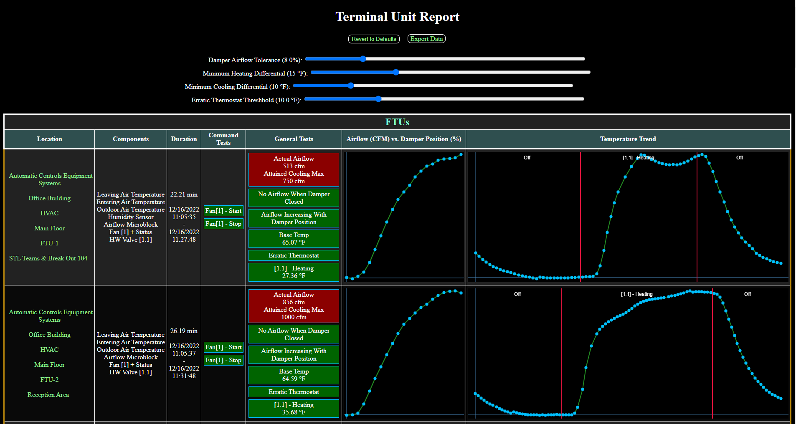
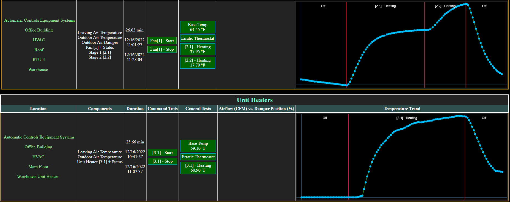

# Terminal Unit Commissioning Script

WebCTRL is a trademark of Automated Logic Corporation. Any other trademarks mentioned herein are the property of their respective owners.

- [Terminal Unit Commissioning Script](#terminal-unit-commissioning-script)
  - [Overview](#overview)
  - [Interpreting Results](#interpreting-results)
    - [General Tests](#general-tests)
    - [Sample Output](#sample-output)
  - [Mappings](#mappings)
    - [Sensors](#sensors)
    - [Locked Points](#locked-points)
    - [Dehumidification](#dehumidification)
    - [Airflow Dampers](#airflow-dampers)
    - [OA / RA Dampers](#oa--ra-dampers)
    - [Fans](#fans)
    - [Heating / Cooling Elements](#heating--cooling-elements)
  - [Sample Mapping + Pseudocode](#sample-mapping--pseudocode)
    - [Airflow Damper, Supply Fan, HW Valve, Two Stage Cooling](#airflow-damper-supply-fan-hw-valve-two-stage-cooling)

## Overview

Refer to the [Commissioning Scripts](https://github.com/automatic-controls/commissioning-scripts) add-on for WebCTRL. This script [(download link)](https://github.com/automatic-controls/terminal-unit-script/releases/latest/download/TerminalUnitTest.jar) supports the following control schemes:

- **Airflow Damper** - Creates and analyzes a graph of airflow (*cfm*) vs damper position (*%*). Intended for use with dampers controlled by an airflow microblock (e.g, the integrated dampers on [ZN141A](https://www.automatedlogic.com/en/products/webctrl-building-automation-system/building-controllers/zn141a/), [ZN341A](https://www.automatedlogic.com/en/products/webctrl-building-automation-system/building-controllers/zn341a/), [OF141-E2](https://www.automatedlogic.com/en/products/webctrl-building-automation-system/building-controllers/OF141-E2/), and [OF342-E2](https://www.automatedlogic.com/en/products/webctrl-building-automation-system/building-controllers/OF342-E2/). When heating/cooling elements are tested, the airflow setpoint is set to the heating/cooling maximum.
- **Fans** - Performs start/stop tests on any number of fans. Requires a binary/analog output to command each fan on or off. Optionally may include a second output which controls VFD speed. The script expects a binary input for monitoring fan status. When testing airflow dampers and heating/cooling elements, all fans are commanded on to ensure adequate airflow.
- **Heating / Cooling Elements** - Creates and analyzes a graph of temperature (*&deg;F*) vs time (*minutes*). Requires an output for turning each element on/off. Also requires a leaving air temperature sensor, but an entering air temperature sensor is optional. An optional status input and reversing output may be included. The reversing output control is designed to switch the mode of an element from heating to cooling or vice versa.
- **Dehumidification** - Creates and analyzes a graph of humidity (*%*) vs time (*minutes*). Requires a binary/analog output for commanding dehumidification to turn on/off. A binary input is optional for monitoring status. Temperature is also monitored for the duration of this test to verify that dehumidification mode does not significantly alter temperature.
- **OA / RA Dampers** - For the duration of all tests, the OA damper is fully closed, and the RA damper is fully opened. In the future, I may implement logic to test economizing capabilities of OA / RA dampers.

If your control program does not match these specifications exactly, there are workarounds which can be implemented in the logic. For example, if a supply fan uses an analog input to monitor status by measuing amp draw, then you could throw an *BACnet Binary Value Status* microblock into the logic which turns on when the amp draw is above a certain threshold. Then you would map the status tag to this microblock instead.

You should ensure air and water sources are activated appropriately before running tests. For instance, someone should turn on the RTU's which serve the terminal units. If there are any hot water valves, then the boiler system should also be turned on, and the hot water temperature setpoint should be set to an appropriate value. Due to these considerations, it is not recommended to run this script on a schedule. In the future, I may add functionality which addresses this.

Various safeties are hard-coded into the script. For instance, if the leaving air temperature drops below *40&deg;F* or exceeds *120&deg;F*, the script will cease testing the current heating/cooling element. A similar circumstance occurs if the script detects a loss of airflow (i.e, all fan are turned off and the measured airflow is smaller than *90 cfm*).

**WARNING** *- If used incorrectly, this script can damage equipment / cause other problems. Be sure that you map all nodes correctly because a single mistake can cause failure. Use this script at your own risk.*

## Interpreting Results

The *location* column provides a link which navigates to the selected control program in WebCTRL. The *components* column lists everything in the control program which was successfully mapped. The *duration* column specifies the start and end time for tests. The *external faults* column contains operational errors that occur during a test (e.g, *loss of airflow* during a heating test). The *internal faults* column contains miscellaneous API errors that may occur (e.g, failure to read/write node values).

The *command tests* column indicates whether fans or elements responded appropriately when commanded on/off. The *general tests* column contains results based on analysis of the collected data. Results are color coded. If no problems are detected, green is used. If there is any sort of communication error, magenta is used. Red is generally used for any other sort of problem detected during the test. If anything unexpected occurs, it is recommended that you check the error log page of the commissioning scripts add-on.

The *export data* button downloads all raw data as a *.json* file. The sliders at the top of the output page allow adjustment of data analysis parameters / thresholds. For example, one of the sliders specifies the minimum temperature difference required for a successful heating element test. Hover over any data graph to view the *(x,y)* position of your cursor. Holding *shift* or *ctrl* while hovering locks your cursor position to the nearest data point.

### General Tests

- **Actual Airflow Attained Cooling Max** - When damper position is *100%*, it is expected that airflow meets or exceeds the cooling maximum design parameter. The *damper airflow tolerance* slider gives extra wiggle room as a proportion of the maximum measured airflow.
- **No Airflow When Damper Closed** - When damper position is *0%*, it is expected that airflow is *0 cfm*. The *damper airflow tolerance* slider gives extra wiggle room as a proportion of the maximum measured airflow.
- **Airflow Increasing With Damper Position** - It is expected that airflow increases as damper position increases. The *damper airflow tolerance* slider gives extra wiggle room as a proportion of the maximum measured airflow.
- **Base Temp** - It is expected that the initial leaving air temperature reading is greater than *-50 &deg;F*.
- **Erratic Thermostat** - It is expected that temperature changes slowly over time. If temperature changes by more than *x* degrees in *10* seconds, where *x* is specified by the *erratic thermostat threshhold* slider, then this test fails.
- **Heating / Cooling** - It is expected that temperature increases/decreases when heating/cooling elements are active. The *Minimum Heating / Cooling Differential* sliders specify the target temperature change.
- **Dehumidification** - It is expected that humidity decreases over time while dehumidification mode is active. The *minimum humidity differential* slider specifies how much humidity needs to decrease for a successful test.
- **Erratic Humidistat** - It is expected that humidity changes slowly over time. If humidity changes by more than *x* percent in *10 seconds*, where *x* is specified by the *erratic humidistat threshold* slider, then this test fails.
- **Dehumidification Temperature Constant** - It is expected that temperature remains constant during dehumidication mode. If temperature changes by more than *x* degrees, where *x* is specified by the *max temp change during dehumidification* slider, then this test fails.

### Sample Output




## Mappings

Control programs with dampers should be grouped by air source. By limiting the percentage of active tests per group, we can avoid tripping the high static safety alarm on the RTU air source (for a worst case scenario, imagine all VAV dampers locked to 0% while the RTU supply fan is still pumping air into the system). If there are hot water valves, you should also consider grouping by water source. See the following tables for a list of mapping tags for this script. Also see [./resources/tags_ex1.json](./resources/tags_ex1.json) for the tag mappings I used while testing this script. Most of the time, you'll just be changing the base node in the sample expression mappings, but there may be exceptions.

### Sensors
| Semantic Tag | Sample Expression | Description |
| - | - | - |
| `alarm` | `alarm/present_value` | Custom alarm |
| `eat` | `eat/present_value` | Entering air temperature (EAT) |
| `eat_status` | `eat/output2` | Whether EAT is valid |
| `eat_fault` | `eat/status_flags/fault` | Whether EAT has a fault |
| `lat` | `lat/present_value` | Leaving air temperature (LAT) |
| `lat_status` | `lat/output2` | Whether LAT is valid |
| `lat_fault` | `lat/status_flags/fault` | Whether LAT has a fault |
| `oat` | `oat/present_value` | Outside air temperature (OAT) |
| `oat_status` | `oat/output2` | Whether OAT is valid |
| `oat_fault` | `oat/status_flags/fault` | Whether OAT has a fault |
| `humidity` | `humidity/present_value` | Zone humidity (ZH) |
| `humidity_status` | `humidity/output2` | Whether ZH is valid |
| `humidity_fault` | `humidity/status_flags/fault` | Whether ZH has a fault |

If the `alarm` mapping returns *true* at any point, the test is terminated immediately. All the status and fault tag mappings are optional. For instance, `lat` is the only required tag mapping to register a leaving air temperature component. However, it is suggested to map status and fault tags for all applicable components. The OAT tags are not currently used for any test, but they may be sometime in the future.

### Locked Points
| Semantic Tag | Sample Expression | Description |
| - | - | - |
| `on#_lock_flag` | `on#/locked` | Whether the #<sup>th</sup> *on*-point is locked |
| `on#_lock_value` | `on#/locked_value` | Locking value for the #<sup>th</sup> *on*-point |
| `on#_lock_min` | `on#/min_pres_value` | Minimum lock value for the #<sup>th</sup> *on*-point |
| `on#_lock_max` | `on#/max_pres_value` | Maximum lock value for the #<sup>th</sup> *on*-point |
| `off#_lock_flag` | `off#/locked` | Whether the #<sup>th</sup> *off*-point is locked |
| `off#_lock_value` | `off#/locked_value` | Locking value for the #<sup>th</sup> *off*-point |
| `off#_lock_min` | `off#/min_pres_value` | Minimum lock value for the #<sup>th</sup> *off*-point |
| `off#_lock_max` | `off#/max_pres_value` | Maximum lock value for the #<sup>th</sup> *off*-point |

Each *on*-point is locked on at the beginning of each test. Each *off*-point is locked off at the beginning of each test. The tags with suffix `_lock_flag` or `_lock_value` are required, but all others are optional. The `_lock_min` and `_lock_max` tag suffixes are helpful when the point is analog, so the script knows which lock values constitute *on* and *off*.

For mapping multiple *on* and *off* points, occurences of `#` should be replaced with a number. For instance, one might have mappings for `on1_lock_flag`, `on1_lock_value`, `on2_lock_flag`, and `on2_lock_value`. This numbering schema `#` applies in other sections as well.

### Dehumidification
| Semantic Tag | Sample Expression | Description |
| - | - | - |
| `dehum_lock_flag` | `dehum/locked` | Whether the dehumidification (DEHU) output is locked |
| `dehum_lock_value` | `dehum/locked_value` | Locking value for the DEHU output |
| `dehum_lock_min` | `dehum/min_pres_value` | Minimum DEHU lock value |
| `dehum_lock_max` | `dehum/max_pres_value` | Maximum DEHU lock value |
| `dehum_fault` | `dehum/status_flags/fault` | Whether DEHU has a fault |
| `dehum_status` | `dehum_status/present_value` | Whether the DEHU component has status |

These mappings are meant to control a single analog/binary output. Before testing dehumidification mode, all elements with a reversing command are switched to cooling mode. It is expected that locking this output on is sufficient to simulate/trigger dehumidification mode. The `dehum_lock_flag` and `dehum_lock_value` tags are required, but the others are optional. `dehum_status` might be mapped to a particular compressor's status in a heat pump, for example.

### Airflow Dampers
| Semantic Tag | Sample Expression | Description |
| - | - | - |
| `airflow_measured` | `airflow/flow_tab/actual_flow` | Actual measured airflow |
| `airflow_setp_lock_flag` | `airflow/flow_tab/lock_flags/flowsetp` | Whether the airflow setpoint is locked |
| `airflow_setp_lock_value` | `airflow/flow_tab/flowsetp_lock` | Locking value for the airflow setpoint |
| `airflow_for_max_cool` | `airflow/flow_tab/max_cool` | Cooling maximum airflow |
| `airflow_for_max_heat` | `airflow/flow_tab/max_heat` | Heating maximum airflow |
| `airflow_damper_lock_flag` | `airflow/flow_tab/lock_flags/damper` | Whether the airflow damper setpoint is locked |
| `airflow_damper_lock_value` | `airflow/flow_tab/damper_lock` | Locking value for the airflow damper setpoint |
| `airflow_damper_position` | `airflow/flow_tab/damper_position` | Actual measured damper position |
| `airflow_fault` | `airflow/flow_tab/status_flags/fault` | Whether the airflow damper has a fault |

All of these mappings are required to define an airflow damper. The base node of these mappings should be to the primary airflow microblock of each control program.

### OA / RA Dampers
| Semantic Tag | Sample Expression | Description |
| - | - | - |
| `oa_damper_lock_flag` | `oa_damper/locked` | Whether OA damper output is locked |
| `oa_damper_lock_value` | `oa_damper/locked_value` | Locking value for OA damper output |
| `oa_damper_lock_min` | `oa_damper/min_pres_value` | Minimum OA damper lock value |
| `oa_damper_lock_max` | `oa_damper/max_pres_value` | Maximum OA damper lock value |
| `oa_damper_fault` | `oa_damper/status_flags/fault` | Whether the OA damper has a fault |
| `oa_damper_min_position` | `oa_damper_min/present_value` | Ideal OA damper minimum position when unit is occupied |
| `ra_damper_lock_flag` | `ra_damper/locked` | Whether RA damper output is locked |
| `ra_damper_lock_value` | `ra_damper/locked_value` | Locking value for RA damper output |
| `ra_damper_lock_min` | `ra_damper/min_pres_value` | Minimum RA damper lock value |
| `ra_damper_lock_max` | `ra_damper/max_pres_value` | Maximum RA damper lock value |
| `ra_damper_fault` | `ra_damper/status_flags/fault` | Whether the RA damper has a fault |

In the case of a mechanically interlocked OA / RA damper, you should map the `oa_damper_` prefixed tags to the interlocked output, and leave the `ra_damper_` prefixed tags unmapped.

### Fans
| Semantic Tag | Sample Expression | Description |
| - | - | - |
| `fan#_lock_flag` | `fan#/locked` | Whether the #<sup>th</sup> fan output is locked |
| `fan#_lock_value` | `fan#/locked_value` | Locking value for the #<sup>th</sup> fan output |
| `fan#_lock_min` | `fan#/min_pres_value` | Minimum lock value for the #<sup>th</sup> fan |
| `fan#_lock_max` | `fan#/max_pres_value` | Maximum lock value for the #<sup>th</sup> fan |
| `fan#_fault` | `fan#/status_flags/fault` | Whether the #<sup>th</sup> fan has a fault |
| `fan#_status` | `fan#_status/present_value` | Whether the #<sup>th</sup> fan has status |
| `fan#_vfd_lock_flag` | `fan#_vfd/locked` | Whether the #<sup>th</sup> fan VFD output is locked |
| `fan#_vfd_lock_value` | `fan#_vfd/locked_value` | Locking value for the #<sup>th</sup> fan VFD output |
| `fan#_vfd_lock_min` | `fan#_vfd/min_pres_value` | Minimum lock value for the #<sup>th</sup> fan VFD |
| `fan#_vfd_lock_max` | `fan#_vfd/max_pres_value` | Maximum lock value for the #<sup>th</sup> fan VFD |
| `fan#_vfd_fault` | `fan#_vfd/status_flags/fault` | Whether the #<sup>th</sup> fan VFD has a fault |

Multiple fans may be mapped by replace `#` with a number. If a fan does not have a VFD, then `fan#_lock_flag` and `fan#_lock_value` are required mappings, and everything else is optional. If a fan has a VFD, then `fan#_vfd_lock_flag` and `fan#_vfd_lock_value` are required mappings, and everything else is optional. The script also supports fans that have both outputs (on/off command and modulating VFD).

### Heating / Cooling Elements
| Semantic Tag | Sample Expression | Description |
| - | - | - |
| `e#_#_name` | `@e#_#` | Name of the #<sup>th</sup> element |
| `e#_#_lock_flag` | `e#_#/locked` | Whether the #<sup>th</sup> element is locked |
| `e#_#_lock_value` | `e#_#/locked_value` | Locking value for the #<sup>th</sup> element |
| `e#_#_lock_min` | `e#_#/min_pres_value` | Minimum lock value for the #<sup>th</sup> element |
| `e#_#_lock_max` | `e#_#/max_pres_value` | Maximum lock value for the #<sup>th</sup> element |
| `e#_#_fault` | `e#_#/status_flags/fault` | Whether the #<sup>th</sup> element has a fault |
| `e#_#_status` | `e#_#_status/present_value` | Whether the #<sup>th</sup> element has status |
| `e#_#_rv_lock_flag` | `e#_#_rv/locked` | Whether the #<sup>th</sup> element reversing command is locked |
| `e#_#_rv_lock_value` | `e#_#_rv/locked_value` | Locking value for the #<sup>th</sup> element reversing command |
| `e#_#_rv_lock_min` | `e#_#_rv/min_pres_value` | Minimum lock value for #<sup>th</sup> element reversing command |
| `e#_#_rv_lock_max` | `e#_#_rv/max_pres_value` | Maximum lock value for #<sup>th</sup> element reversing command |
| `e#_#_rv_fault` | `e#_#_rv/status_flags/fault` | Whether the #<sup>th</sup> element reversing command has a fault |

`e#_#_lock_flag` and `e#_#_lock_value` are required, but everything else is optional. Note the sample expression for `e#_#_name` begins with `@`, which means it is interpreted literally (as opposed to a node mapping pattern). So you can name the #<sup>th</sup> element explicitly, like `@HW Valve` or `@Heat Pump`.

You can replace `e` with `h` or `c` to denote heating or cooling, respectively. The only practical difference this makes is in determining the damper airflow setpoint (when it exists) during the test. The damper position is set to *100%* for `e` elements. For `h` and `c` components, the damper airflow setpoint is set to the heating and cooling maximums, respectively.

The first number placeholder `#` is a unique identifer for the element, and the second placeholder specifies the stage. For instance, `h3_2` represents the 2<sup>nd</sup> stage of the 3<sup>rd</sup> element (with `h` heating configuration). If you leave the second placeholder blank (e.g, `c6`), then the script autocompletes the stage number as *1* (e.g, `c6_1`).

Regardless of the mode configuration (`e`, `c`, or `h`), the element identifier should be unique. So there should not be mappings for both `c1` and `h1` (in this case, you would likely change the tags to `c1` and `h2` instead).

When the mode configuration is `e`, the script will attempt to detect whether the element is heating or cooling based on how the temperature changes when the element is commanded on. This may be useful in cases where we do not *apriori* know the configuration (e.g, two-pipe systems or heat pumps in some cases). Elements with multiple stages generally should not have reversing command mappings.

It is suggested to have seasonal mappings for some equipment. For instance, it may be harmful to to run a DX compressor in the winter. So the winter mapping should put the DX compressor on a locked *off*-point for the test, whereas the summer mapping would use an element mapping with `c` configuration.

## Sample Mapping + Pseudocode
### Airflow Damper, Supply Fan, HW Valve, Two Stage Cooling
```json
{
  "lat": "dat/present_value",
  "lat_status": "dat/output2",
  "lat_fault": "dat/status_flags/fault",

  "airflow_measured": "airflow/flow_tab/actual_flow",
  "airflow_setp_lock_flag": "airflow/flow_tab/lock_flags/flowsetp",
  "airflow_setp_lock_value": "airflow/flow_tab/flowsetp_lock",
  "airflow_for_max_cool": "airflow/flow_tab/max_cool",
  "airflow_for_max_heat": "airflow/flow_tab/max_heat",
  "airflow_damper_lock_flag": "airflow/flow_tab/lock_flags/damper",
  "airflow_damper_lock_value": "airflow/flow_tab/damper_lock",
  "airflow_damper_position": "airflow/flow_tab/damper_position",
  "airflow_fault": "airflow/flow_tab/status_flags/fault",
  
  "fan1_lock_flag": "sfss/locked",
  "fan1_lock_value": "sfss/locked_value",
  "fan1_lock_min": "sfss/min_pres_value",
  "fan1_lock_max": "sfss/max_pres_value",
  "fan1_fault": "sfss/status_flags/fault",
  "fan1_status": "sfst/present_value",

  "h1_name": "@HW Valve",
  "h1_lock_flag": "hwv/locked",
  "h1_lock_value": "hwv/locked_value",
  "h1_lock_min": "hwv/min_pres_value",
  "h1_lock_max": "hwv/max_pres_value",
  "h1_fault": "hwv/status_flags/fault",

  "c2_1_name": "@DX Stage 1",
  "c2_1_lock_flag": "dx1ss/locked",
  "c2_1_lock_value": "dx1ss/locked_value",
  "c2_1_lock_min": "dx1ss/min_pres_value",
  "c2_1_lock_max": "dx1ss/max_pres_value",
  "c2_1_fault": "dx1ss/status_flags/fault",
  "c2_1_status": "dx1st/present_value",

  "c2_2_name": "@DX Stage 2",
  "c2_2_lock_flag": "dx2ss/locked",
  "c2_2_lock_value": "dx2ss/locked_value",
  "c2_2_lock_min": "dx2ss/min_pres_value",
  "c2_2_lock_max": "dx2ss/max_pres_value",
  "c2_2_fault": "dx2ss/status_flags/fault",
  "c2_2_status": "dx2st/present_value"
}
```
1. Lock the HW Valve to *0%*. Lock both DX stages off.
2. Wait up to *260 seconds* for each DX stage status feedback to turn off.
3. Lock the airflow damper to *100%*. Lock the supply fan off.
4. Wait up to *260 seconds* for the supply fan status feedback to turn off.
5. Lock the supply fan on.
6. Wait up to *260 seconds* for the supply fan status feedback to turn on.
7. Repeat the following for $x\in\\{100,95,90,85,80,75,70,65,60,55,50,45,40,35,30,25,20,15,10,5,0\\}$
   1. Lock the airflow damper to $x$ *percent*.
   2. Wait up to *260* seconds for the measured airflow damper position to be within *1%* of $x$.
   3. Measure the airflow *5 times* at *2 second* intervals, and record the averaged result.
8. Lock the airflow damper to *100%*.
9. Wait up to *260 seconds* for the airflow damper position to exceed *80%*.
10. If the total time taken in steps 2-9 does not exceed *260* seconds, wait until that time has passed.
11. Measure the temperature *30 times* at *10 second* intervals. This data comprises the first section of the temperature graph.
12. Lock the HW valve to *100%*. Lock the airflow damper setpoint to the heating maximum.
13. Measure temperature at *10 second* intervals, and wait for the temperature graph to stabilize.
14. Lock the HW valve to *0%*.
15. Measure temperature *26 times* at *10 second* intervals.
16. Lock stage 1 DX cooling on. Lock the airflow damper setpoint to the cooling maximum.
17. Wait up to *260 seconds* for the stage 1 DX status feedback to turn on. Measure temperature at *10 second* intervals while waiting for status feedback.
18. Measure temperature at *10 second* intervals, and wait for the temperature graph to stabilize.
19. Lock stage 2 DX cooling on.
20. Wait up to *260 seconds* for the stage 2 DX status feedback to turn on. Measure temperature at *10 second* intervals while waiting for status feedback.
21. Measure temperature at *10 second* intervals, and wait for the temperature graph to stabilize.
22. Lock all DX cooling stages off.
23. Measure temperature *26 times* at *10 second* intervals.
24. Return all nodes to their default values (e.g, unlock points which were locked earlier in the test).

- Note: You can use the `timeout_multiplier` mapping for controlling timeout durations to some extent. The default value is `@26`. For example, if this tag was mapped to `@32`, then the *260* second timeouts specified above would be *320* seconds instead.